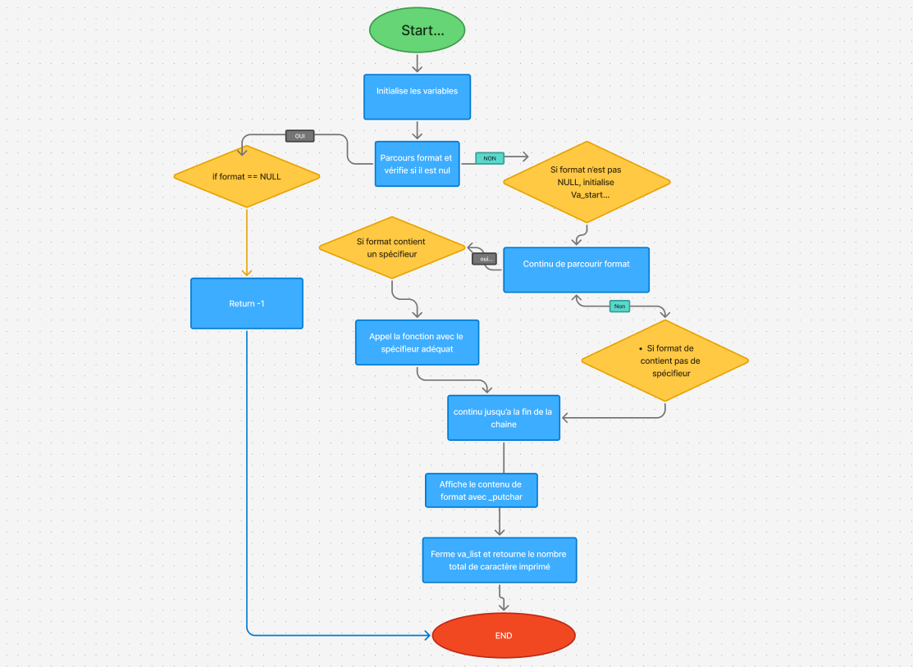
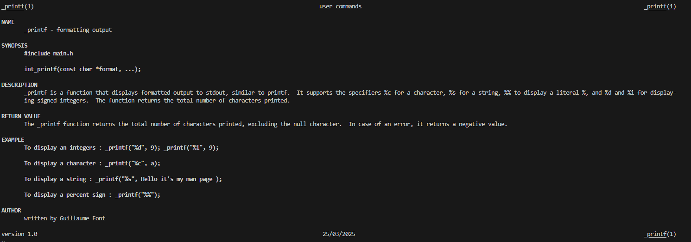

## Description

Ce projet consiste en l'implémentation d'une version simplifiée de la fonction standard printf de la bibliothèque C. Notre fonction _printf permet de formater et d'afficher des données à l'écran en prenant en charge plusieurs spécificateurs de format.

## Fonctionnalités

La fonction _printf peut gérer les spécificateurs de format suivants :

- `%c` : Affiche un caractère
- `%s` : Affiche une chaîne de caractères
- `%%` : Affiche le caractère '%'
- `%d` et `%i` : Affiche un entier

## Structure du projet

- _printf.c : Fonction principale qui analyse la chaîne de format et gère l'affichage
- spec_func.c : Contient les fonctions pour gérer les différents spécificateurs de format
- 1-main.c : Implémente les fonctions d'impression pour les caractères, chaînes et pourcentages
- _putchar.c : Fonction utilitaire pour écrire un caractère dans la sortie standard
- main.h : Fichier d'en-tête avec les déclarations de fonctions et structures

## Utilisation

```c
#include "main.h"

int main(void)
{
    _printf("Caractère : %c\n", 'A');
    _printf("Chaîne : %s\n", "Bonjour");
    _printf("Pourcentage : %%\n");
    _printf("Entier : %d\n", 42);
    
    return (0);
}
```

## Fonctionnement

1. La fonction `_printf` parcourt la chaîne de format caractère par caractère
2. Les caractères normaux sont affichés directement
3. Lorsqu'un caractère '%' est rencontré, la fonction analyse le caractère suivant
4. En fonction du spécificateur, elle appelle la fonction appropriée via `spec_func`
5. Les fonctions spécifiques (`print_char`, `print_string`, etc.) traitent et affichent l'argument correspondant
6. Pour l'éxécution du programme :
```c
 gcc -Wall -Wextra -Werror -pedantic -std=gnu89 -Wno-format *.c 
```


```c
typedef struct print_func
{
    char type;
    int (*print_func)(va_list);
} print_func_t;
```
## Flowchart

- 

## ManPage

- 


## Auteurs

Guillaume Font